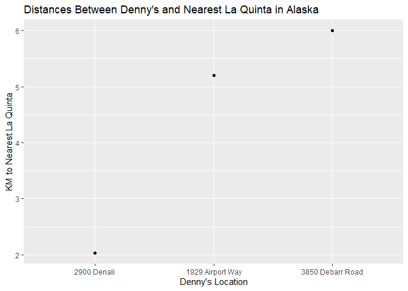
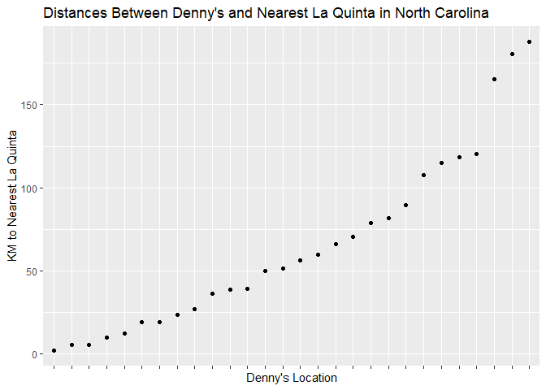
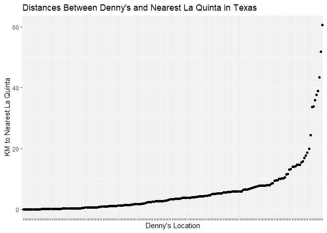

Lab 05 - wrangling spacial data
================
Ben Waggener
3/21/2025

### Load packages and data

``` r
library(tidyverse) 
```

    ## Warning: package 'tidyverse' was built under R version 4.4.3

    ## Warning: package 'purrr' was built under R version 4.4.3

``` r
library(dsbox) 
```

``` r
states <- read_csv("data/states.csv")
```

### Exercise 1

“Filter the Denny’s data frame for Alaska (AK) and save the result as
dn_ak. How many Denny’s locations are there in Alaska?”

``` r
dn_ak <- dennys %>%
  filter(state == "AK")
nrow(dn_ak)
```

    ## [1] 3

“Now, do the same for La Quinta data frame for Alaska (AK) and save the
result as lq_ak. How many La Quinta locations are there in Alaska?”

``` r
lq_ak <- laquinta %>%
  filter(state == "AK")
nrow(lq_ak)
```

    ## [1] 2

There are 3 dennys in Alaska and 2 La Quintas in Alaska.

### Exercise 2

“Next we will be calculating the distance between all Denny’s and all La
Quinta locations in Alaska.”

there are 6 possible pairings between the 3 Denny’s and 2 La Quintas in
Alaska.

### Exercise 3

“Let’s join the data on Denny’s and La Quinta locations in Alaska, and
take a look at what it looks like:”

``` r
dn_lq_ak <- full_join(dn_ak, lq_ak, 
                      by = "state")
```

    ## Warning in full_join(dn_ak, lq_ak, by = "state"): Detected an unexpected many-to-many relationship between `x` and `y`.
    ## ℹ Row 1 of `x` matches multiple rows in `y`.
    ## ℹ Row 1 of `y` matches multiple rows in `x`.
    ## ℹ If a many-to-many relationship is expected, set `relationship =
    ##   "many-to-many"` to silence this warning.

``` r
dn_lq_ak
```

    ## # A tibble: 6 × 11
    ##   address.x     city.x state zip.x longitude.x latitude.x address.y city.y zip.y
    ##   <chr>         <chr>  <chr> <chr>       <dbl>      <dbl> <chr>     <chr>  <chr>
    ## 1 2900 Denali   Ancho… AK    99503       -150.       61.2 3501 Min… "\nAn… 99503
    ## 2 2900 Denali   Ancho… AK    99503       -150.       61.2 4920 Dal… "\nFa… 99709
    ## 3 3850 Debarr … Ancho… AK    99508       -150.       61.2 3501 Min… "\nAn… 99503
    ## 4 3850 Debarr … Ancho… AK    99508       -150.       61.2 4920 Dal… "\nFa… 99709
    ## 5 1929 Airport… Fairb… AK    99701       -148.       64.8 3501 Min… "\nAn… 99503
    ## 6 1929 Airport… Fairb… AK    99701       -148.       64.8 4920 Dal… "\nFa… 99709
    ## # ℹ 2 more variables: longitude.y <dbl>, latitude.y <dbl>

### Exercise 4

“How many observations are in the joined dn_lq_ak data frame? What are
the names of the variables in this data frame.”

variable names

``` r
nrow(dn_lq_ak)
```

    ## [1] 6

``` r
ncol(dn_lq_ak)
```

    ## [1] 11

``` r
names(dn_lq_ak)
```

    ##  [1] "address.x"   "city.x"      "state"       "zip.x"       "longitude.x"
    ##  [6] "latitude.x"  "address.y"   "city.y"      "zip.y"       "longitude.y"
    ## [11] "latitude.y"

There are 6 observations and 11 variables in the joined data frame. The
variables are “address.x” “city.x” “state” “zip.x” “longitude.x”
“latitude.x” “address.y” “city.y”  
“zip.y” “longitude.y” “latitude.y” …

### Exercise 5

“What function from the tidyverse do we use the add a new variable to a
data frame while keeping the existing variables?” mutate

``` r
haversine <- function(long1, lat1, long2, lat2, round = 3) {
  # convert to radians
  long1 <- long1 * pi / 180
  lat1 <- lat1 * pi / 180
  long2 <- long2 * pi / 180
  lat2 <- lat2 * pi / 180

  R <- 6371 # Earth mean radius in km

  a <- sin((lat2 - lat1) / 2)^2 + cos(lat1) * cos(lat2) * sin((long2 - long1) / 2)^2
  d <- R * 2 * asin(sqrt(a))

  return(round(d, round)) 
}
```

…

### Exercise 6

“Calculate the distances between all pairs of Denny’s and La Quinta
locations and save this variable as distance. Make sure to save this
variable in THE dn_lq_ak data frame, so that you can use it later.”

``` r
dn_lq_ak <- dn_lq_ak %>%
  mutate(distance = haversine(longitude.x, latitude.x, longitude.y, latitude.y))
```

### Exercise 7

“Calculate the minimum distance between a Denny’s and La Quinta for each
Denny’s location. To do so we group by Denny’s locations and calculate a
new variable that stores the information for the minimum distance.”

``` r
dn_lq_ak_mindist <- dn_lq_ak %>%
  group_by(address.x) %>%
  summarize(closest = min(distance))

dn_lq_ak_mindist <- dn_lq_ak_mindist %>%
  mutate(address.x = factor(address.x)) %>%  
  mutate(address.x = fct_relevel(address.x, "2900 Denali", "1929 Airport Way", "3850 Debarr Road"))
```

### Exercise 8

“Describe the distribution of the distances Denny’s and the nearest La
Quinta locations in Alaska. Also include an appropriate visualization
and relevant summary statistics.”

``` r
dn_lq_ak_mindist %>%
  ggplot(aes(x = address.x, y = closest)) +
  geom_point(binwidth = 100, stat = "identity") +
  theme() +
  labs(title = "Distances Between Denny's and Nearest La Quinta in Alaska",
       x = "Denny's Location",
       y = "KM to Nearest La Quinta")
```

    ## Warning in geom_point(binwidth = 100, stat = "identity"): Ignoring unknown
    ## parameters: `binwidth`

<!-- -->

``` r
summary(dn_lq_ak_mindist)
```

    ##             address.x    closest     
    ##  2900 Denali     :1   Min.   :2.035  
    ##  1929 Airport Way:1   1st Qu.:3.616  
    ##  3850 Debarr Road:1   Median :5.197  
    ##                       Mean   :4.410  
    ##                       3rd Qu.:5.598  
    ##                       Max.   :5.998

This distribution of distances between Denny’s and the nearest La Quinta
in Alaska reveals that they are fairly close to eachother, especially
considering how large Alaska is. However, it also may be due to how most
of the people and businesses are located in a few cities. \### Exercise
9

“Repeat the same analysis for North Carolina: (i) filter Denny’s and La
Quinta Data Frames for NC, (ii) join these data frames to get a complete
list of all possible pairings, (iii) calculate the distances between all
possible pairings of Denny’s and La Quinta in NC, (iv) find the minimum
distance between each Denny’s and La Quinta location, (v) visualize and
describe the distribution of these shortest distances using appropriate
summary statistics.”

``` r
dn_nc <- dennys %>%
  filter(state == "NC")
nrow(dn_nc)
```

    ## [1] 28

``` r
lq_nc <- laquinta %>%
  filter(state == "NC")
nrow(lq_nc)
```

    ## [1] 12

``` r
dn_lq_nc <- full_join(dn_nc, lq_nc, 
                      by = "state")
```

    ## Warning in full_join(dn_nc, lq_nc, by = "state"): Detected an unexpected many-to-many relationship between `x` and `y`.
    ## ℹ Row 1 of `x` matches multiple rows in `y`.
    ## ℹ Row 1 of `y` matches multiple rows in `x`.
    ## ℹ If a many-to-many relationship is expected, set `relationship =
    ##   "many-to-many"` to silence this warning.

``` r
dn_lq_nc
```

    ## # A tibble: 336 × 11
    ##    address.x    city.x state zip.x longitude.x latitude.x address.y city.y zip.y
    ##    <chr>        <chr>  <chr> <chr>       <dbl>      <dbl> <chr>     <chr>  <chr>
    ##  1 1 Regent Pa… Ashev… NC    28806       -82.6       35.6 165 Hwy … "\nBo… 28607
    ##  2 1 Regent Pa… Ashev… NC    28806       -82.6       35.6 3127 Slo… "\nCh… 28208
    ##  3 1 Regent Pa… Ashev… NC    28806       -82.6       35.6 4900 Sou… "\nCh… 28217
    ##  4 1 Regent Pa… Ashev… NC    28806       -82.6       35.6 4414 Dur… "\nDu… 27707
    ##  5 1 Regent Pa… Ashev… NC    28806       -82.6       35.6 1910 Wes… "\nDu… 27713
    ##  6 1 Regent Pa… Ashev… NC    28806       -82.6       35.6 1201 Lan… "\nGr… 27407
    ##  7 1 Regent Pa… Ashev… NC    28806       -82.6       35.6 1607 Fai… "\nCo… 28613
    ##  8 1 Regent Pa… Ashev… NC    28806       -82.6       35.6 191 Cres… "\nCa… 27518
    ##  9 1 Regent Pa… Ashev… NC    28806       -82.6       35.6 2211 Sum… "\nRa… 27612
    ## 10 1 Regent Pa… Ashev… NC    28806       -82.6       35.6 1001 Aer… "\nMo… 27560
    ## # ℹ 326 more rows
    ## # ℹ 2 more variables: longitude.y <dbl>, latitude.y <dbl>

``` r
dn_lq_nc <- dn_lq_nc %>%
  mutate(distance = haversine(longitude.x, latitude.x, longitude.y, latitude.y))

dn_lq_nc_mindist <- dn_lq_nc %>%
  group_by(address.x) %>%
  summarize(closest = min(distance))

dn_lq_nc_mindist <- dn_lq_nc_mindist %>%
  mutate(address.x = fct_reorder(address.x, closest)) 
```

``` r
dn_lq_nc_mindist %>%
  ggplot(aes(x = address.x, y = closest)) +
  geom_point(binwidth = 100, stat = "identity") +
  theme(
    axis.text.x = element_blank()
  ) +
  labs(title = "Distances Between Denny's and Nearest La Quinta in North Carolina",
       x = "Denny's Location",
       y = "KM to Nearest La Quinta")
```

    ## Warning in geom_point(binwidth = 100, stat = "identity"): Ignoring unknown
    ## parameters: `binwidth`

<!-- -->

``` r
summary(dn_lq_nc_mindist)
```

    ##                            address.x     closest       
    ##  516 Tyvola Rd                  : 1   Min.   :  1.779  
    ##  3215 Wake Forest Rd            : 1   1st Qu.: 22.388  
    ##  7021 Highway 751, #901         : 1   Median : 53.456  
    ##  4541 Sunset Rd                 : 1   Mean   : 65.444  
    ##  4380 Fayetteville Rd           : 1   3rd Qu.: 93.985  
    ##  University of North Carolina At: 1   Max.   :187.935  
    ##  (Other)                        :22

This distribution of distances between Denny’s and the nearest La Quinta
in North Carolina reveals that there are some that are clustered close
together but also some that are farther away. Suggesting that the joke
does not hold as true in NC as it may in other states. \### Exercise 10
“Repeat the same analysis for Texas.”

``` r
dn_tx <- dennys %>%
  filter(state == "TX")
nrow(dn_tx)
```

    ## [1] 200

``` r
lq_tx <- laquinta %>%
  filter(state == "TX")
nrow(lq_tx)
```

    ## [1] 237

``` r
dn_lq_tx <- full_join(dn_tx, lq_tx, 
                      by = "state")
```

    ## Warning in full_join(dn_tx, lq_tx, by = "state"): Detected an unexpected many-to-many relationship between `x` and `y`.
    ## ℹ Row 1 of `x` matches multiple rows in `y`.
    ## ℹ Row 1 of `y` matches multiple rows in `x`.
    ## ℹ If a many-to-many relationship is expected, set `relationship =
    ##   "many-to-many"` to silence this warning.

``` r
dn_lq_tx
```

    ## # A tibble: 47,400 × 11
    ##    address.x    city.x state zip.x longitude.x latitude.x address.y city.y zip.y
    ##    <chr>        <chr>  <chr> <chr>       <dbl>      <dbl> <chr>     <chr>  <chr>
    ##  1 120 East I-… Abile… TX    79601       -99.6       32.4 3018 Cat… "\nAb… 79606
    ##  2 120 East I-… Abile… TX    79601       -99.6       32.4 3501 Wes… "\nAb… 79601
    ##  3 120 East I-… Abile… TX    79601       -99.6       32.4 14925 La… "\nAd… 75254
    ##  4 120 East I-… Abile… TX    79601       -99.6       32.4 909 East… "\nAl… 78516
    ##  5 120 East I-… Abile… TX    79601       -99.6       32.4 2400 Eas… "\nAl… 78332
    ##  6 120 East I-… Abile… TX    79601       -99.6       32.4 1220 Nor… "\nAl… 75013
    ##  7 120 East I-… Abile… TX    79601       -99.6       32.4 1165 Hwy… "\nAl… 76009
    ##  8 120 East I-… Abile… TX    79601       -99.6       32.4 880 Sout… "\nAl… 77511
    ##  9 120 East I-… Abile… TX    79601       -99.6       32.4 1708 Int… "\nAm… 79103
    ## 10 120 East I-… Abile… TX    79601       -99.6       32.4 9305 Eas… "\nAm… 79118
    ## # ℹ 47,390 more rows
    ## # ℹ 2 more variables: longitude.y <dbl>, latitude.y <dbl>

``` r
dn_lq_tx <- dn_lq_tx %>%
  mutate(distance = haversine(longitude.x, latitude.x, longitude.y, latitude.y))

dn_lq_tx_mindist <- dn_lq_tx %>%
  group_by(address.x) %>%
  summarize(closest = min(distance))

dn_lq_tx_mindist <- dn_lq_tx_mindist %>%
  mutate(address.x = fct_reorder(address.x, closest)) 
```

``` r
dn_lq_tx_mindist %>%
  ggplot(aes(x = address.x, y = closest)) +
  geom_point(binwidth = 100, stat = "identity") +
  theme(
    axis.text.x = element_blank()
  ) +
  labs(title = "Distances Between Denny's and Nearest La Quinta in Texas",
       x = "Denny's Location",
       y = "KM to Nearest La Quinta")
```

    ## Warning in geom_point(binwidth = 100, stat = "identity"): Ignoring unknown
    ## parameters: `binwidth`

<!-- -->

``` r
summary(dn_lq_tx_mindist)
```

    ##                       address.x      closest       
    ##  607 Avenue Q              :  1   Min.   : 0.0160  
    ##  1410 Seawall Blvd         :  1   1st Qu.: 0.7305  
    ##  3600 Santa Ursula         :  1   Median : 3.3715  
    ##  7619 E Ben White Boulevard:  1   Mean   : 5.7918  
    ##  28669 I-45 North          :  1   3rd Qu.: 6.6303  
    ##  1108 S Fort Hood Rd       :  1   Max.   :60.5820  
    ##  (Other)                   :194

Considering how large texas is, this distribution of distances between
Denny’s and the nearest La Quinta in Texas reveals that they are
generally close to eachother. This suggests that the joke may hold true
in Texas.

### Exercise 11

“Repeat the same analysis for a state of your choosing, different than
the ones we covered so far.”

``` r
dn_az <- dennys %>%
  filter(state == "AZ")
nrow(dn_az)
```

    ## [1] 83

``` r
lq_az <- laquinta %>%
  filter(state == "AZ")
nrow(lq_az)
```

    ## [1] 18

``` r
dn_lq_az <- full_join(dn_az, lq_az, 
                      by = "state")
```

    ## Warning in full_join(dn_az, lq_az, by = "state"): Detected an unexpected many-to-many relationship between `x` and `y`.
    ## ℹ Row 1 of `x` matches multiple rows in `y`.
    ## ℹ Row 1 of `y` matches multiple rows in `x`.
    ## ℹ If a many-to-many relationship is expected, set `relationship =
    ##   "many-to-many"` to silence this warning.

``` r
dn_lq_az
```

    ## # A tibble: 1,494 × 11
    ##    address.x    city.x state zip.x longitude.x latitude.x address.y city.y zip.y
    ##    <chr>        <chr>  <chr> <chr>       <dbl>      <dbl> <chr>     <chr>  <chr>
    ##  1 4121 W Anth… Anthem AZ    85086       -112.       33.9 "2015 So… "\nFl… 86001
    ##  2 4121 W Anth… Anthem AZ    85086       -112.       33.9 "3419 Ho… "\nKi… 86409
    ##  3 4121 W Anth… Anthem AZ    85086       -112.       33.9 "70 Kaib… "\nPa… 86040
    ##  4 4121 W Anth… Anthem AZ    85086       -112.       33.9 "6530 Ea… "\nMe… 85206
    ##  5 4121 W Anth… Anthem AZ    85086       -112.       33.9 "6020 We… "\nTu… 85743
    ##  6 4121 W Anth… Anthem AZ    85086       -112.       33.9 "15241 S… "\nPh… 85044
    ##  7 4121 W Anth… Anthem AZ    85086       -112.       33.9 "4929 We… "\nPh… 85035
    ##  8 4121 W Anth… Anthem AZ    85086       -112.       33.9 "902 Wes… "\nMe… 85210
    ##  9 4121 W Anth… Anthem AZ    85086       -112.       33.9 "2510 W … "\nPh… 85023
    ## 10 4121 W Anth… Anthem AZ    85086       -112.       33.9 "8888 Ea… "\nSc… 85260
    ## # ℹ 1,484 more rows
    ## # ℹ 2 more variables: longitude.y <dbl>, latitude.y <dbl>

``` r
dn_lq_az <- dn_lq_az %>%
  mutate(distance = haversine(longitude.x, latitude.x, longitude.y, latitude.y))

dn_lq_az_mindist <- dn_lq_az %>%
  group_by(address.x) %>%
  summarize(closest = min(distance))

dn_lq_az_mindist <- dn_lq_az_mindist %>%
  mutate(address.x = fct_reorder(address.x, closest))
```

``` r
dn_lq_az_mindist %>%
  ggplot(aes(x = address.x, y = closest)) +
  geom_point(binwidth = 100, stat = "identity") +
  theme(
    axis.text.x = element_blank()
  ) +
  labs(title = "Distances Between Denny's and Nearest La Quinta in Arizona",
       x = "Denny's Location",
       y = "KM to Nearest La Quinta")
```

    ## Warning in geom_point(binwidth = 100, stat = "identity"): Ignoring unknown
    ## parameters: `binwidth`

<!-- -->

``` r
summary(dn_lq_az_mindist)
```

    ##                 address.x     closest       
    ##  2801 No Black Canyon: 1   Min.   :  0.021  
    ##  6484 E Broadway     : 1   1st Qu.:  4.629  
    ##  825 S 48th St       : 1   Median :  7.946  
    ##  2122 S Milton Road  : 1   Mean   : 36.936  
    ##  8131 W Bell Rd      : 1   3rd Qu.: 38.067  
    ##  7400 W Chandler Blvd: 1   Max.   :242.734  
    ##  (Other)             :77

### Exercise 12

“Among the states you examined, where is Mitch Hedberg’s joke most
likely to hold true? Explain your reasoning.” Texas seems to fit the
joke the best. The distances between Denny’s and La Quinta locations in
Texas are generally shorter than in the other states that I looked at.
Just by looking at the range of distances between Denny’s and La Quinta
locations, Texas has the lowest maximum range of distances and the vast
majority are within 10 miles of each other.
